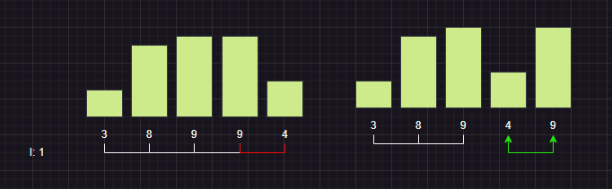

# Algoritmos

## Sort

### Bubble

Compara 2 elementos secuencialmente de la iteración y el elemento **mayor** lo desplaza hasta un elemento mayor que esté, para continuar el proceso en la misma iteracion.

### Selection

Identifica el **minino** de la iteración y lo cambia por el elemento **seleccionado**

### Insertion

Toma el elemento de la iteración y compara hacia atras de su posición hasta encontrar un elemento mayor que este.
